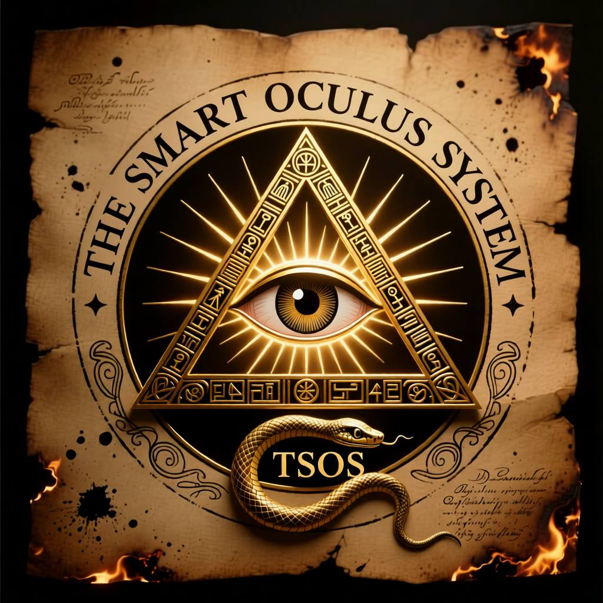

<div align="center">

<video src="media/video.mp4" controls loop muted playsinline width="640"></video>

</div>

<div align="center">
    <span style="font-size:2em; font-weight:bold;">
        👀 The Smart Oculus System (TSOS) 👀<br>
        💪 Powered by AI 🤖
    </span>
</div>

<div align="center">
    TSOS - это система для анализа видео файлов и отслеживания определённых триггеров
</div>

## Quick Start Guide

### 0. Требования
- Python 3.11+, PostgreSQL 13+, FFmpeg установлен
- Опционально — OpenRouter API key или собственный провайдер

### 1. Готовим окружение
```bash
python -m venv venv && source venv/bin/activate   # или venv\Scripts\activate
pip install -r requirements.txt
cp env.example .env
```

### 2. Создаём БД и пользователя
```sql
CREATE DATABASE tsos;
CREATE USER tsos_user WITH PASSWORD 'change_me';
GRANT ALL PRIVILEGES ON DATABASE tsos TO tsos_user;
```
В файле `.env` настройте:
- `DB_*` — параметры подключения
- `API_HOST`, `API_PORT`
- `SECRET_KEY` — строка для подписи и Bearer токена
- ключи AI-провайдеров (`OPENROUTER_API_KEY`, `OLLAMA_API_KEY`, и т.д.)
- тексты подсказок `SUMMARY_PROMPT` (описание сцены) и `PEOPLE_COUNT_PROMPT` (подсчёт людей)

### 3. Миграции Alembic
```bash
# при необходимости создаём новую ревизию
alembic revision --autogenerate -m "init"
# применяем схему
alembic upgrade head
# проверяем текущее состояние
alembic current
```

### 4. Запуск сервиса локально
```bash
python main.py
# или для разработки
uvicorn src.app:app --reload --host 0.0.0.0 --port 8000
```

### 5. Тесты и линт
```bash
pytest
flake8
```

### 6. Проверка API
```bash
# загрузка видео
curl -X POST http://localhost:8000/api/v1/analyze \
  -H "Authorization: Bearer <SECRET_KEY>" \
  -F "file=@/path/to/video.mp4"

# статус задачи
curl -H "Authorization: Bearer <SECRET_KEY>" \
  http://localhost:8000/api/v1/tasks/<TASK_ID>

# метрики
curl http://localhost:8000/metrics
```

## Docker Workflow
```bash
docker build -t tsos .

# применяем миграции во временном контейнере
docker run --rm --env-file .env tsos alembic upgrade head

# запускаем API
docker run -p 8000:8000 --env-file .env tsos
```
> Образ не выполняет миграции автоматически — запускайте команду `alembic upgrade head` перед стартом.

## Providers & Metrics
- В реализации по умолчанию подключён провайдер OpenRouter: сервис берёт кадры из видео и отправляет их в OpenRouter для получения summary и подсчёта людей.
- Для проверки работы безопаснее всего использовать собственный ключ: перейдите на [openrouter.ai/keys](https://openrouter.ai/keys), создайте API key и пропишите его в `.env` (`OPENROUTER_API_KEY=sk-or-...`). После перезапуска приложения запросы начнут подписываться этим ключом, и лимиты будут привязаны к вашему аккаунту.
- `SUMMARY_PROMPT` — текст, по которому LLM формирует human-friendly описание. `PEOPLE_COUNT_PROMPT` — отдельная подсказка, по которой LLM возвращает количество уникальных людей (ответ только числом; берём максимум по всем кадрам).
- Для локальной модели (Qwen/Ollama) добавьте клиента в `src/providers/` и используйте его в `src/services/video_processor.py`.

### Пример локальной модели (Qwen + Ollama)
1. Установите [Ollama](https://ollama.com/download) и выполните `ollama pull qwen:7b`.
2. Реализуйте клиента, который бьёт в `http://localhost:11434/v1`.
3. В `.env` добавьте `OLLAMA_API_KEY=<любое значение>`, чтобы выбрать локального провайдера.
4. В `process_video_task` переключите вызов на нового клиента.

## API Summary
- `POST /api/v1/analyze` — загружает видео, создаёт задачу.
- `GET /api/v1/tasks/{task_id}` — возвращает статус, метрики, ошибки.
- `GET /metrics` — Prometheus-формат (`tsos_videos_processed_total`, `tsos_videos_failed_total`, `tsos_video_processing_seconds`).

### Проверка через Swagger
1. Запустите сервис (`python main.py` или контейнер).
2. Откройте [http://localhost:8000/docs](http://localhost:8000/docs).
3. Нажмите **Authorize** и введите `Bearer <SECRET_KEY>`.
4. Выполните `POST /api/v1/analyze`, передав видеофайл.
5. Сразу после этого можно вызвать `GET /api/v1/tasks/{task_id}` — скопируйте `task_id` из ответа и вставьте в поле параметра.
6. Для live-метрик откройте [http://localhost:8000/metrics](http://localhost:8000/metrics) или используйте `/docs` → `GET /metrics`.

### Быстрый тест OpenRouter (без изображений)
```bash
export OPENROUTER_API_KEY=sk-or-...   # PowerShell: setx OPENROUTER_API_KEY "sk-or-..."
python scripts/test_openrouter.py
```
Скрипт отправляет простой текст “Привет, расскажи шутку!” и выводит ответ модели. Удобно, чтобы проверить корректность ключа без запуска всего пайплайна.

<div align="center" style="margin-top: 40px;">
    
</div>
